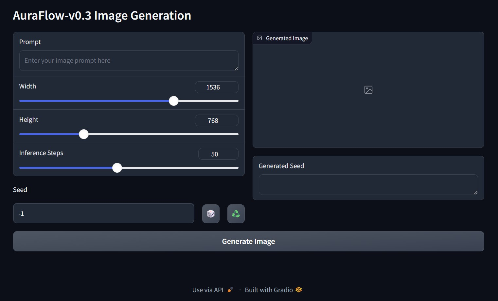

# AuraFlow v0.3 UI



This is a simple UI for AuraFlow v0.3, a text-to-image generation model. Images are automatically saved to the output folder. Some of my generated images are already in the output folder if you want to check them out. You can input a text prompt and generate an image based on the text. The model is trained on a variety of aesthetic datasets and supports various aspect ratios. Tested on Python 3.12 🎉


AuraFlow v0.3 is the fully open-sourced flow-based text-to-image generation model. The model was trained with more compute compared to the previous version, [AuraFlow-v0.2](https://huggingface.co/fal/AuraFlow-v0.2).

Compared to AuraFlow-v0.2, the model is fine-tuned on more aesthetic datasets and supports various aspect ratios 🎂.

This model achieves state-of-the-art results on GenEval. Read our [blog post](https://blog.fal.ai/auraflow/) for more technical details. You can also check out the comparison with other models on this gallery [page](https://cloneofsimo.github.io/compare_aura_sd3/).

The model is currently in beta. We are working on improving it and the community's feedback is important.
Join [fal's Discord](https://discord.gg/fal-ai) to give us feedback and stay in touch with the model development.

Credits: A huge thank you to [@cloneofsimo](https://twitter.com/cloneofsimo) and [@isidentical](https://twitter.com/isidentical) for bringing this project to life. It's incredible what two cracked engineers can achieve in
such a short period of time. We also extend our gratitude to the incredible researchers whose prior work laid the foundation for our efforts.

## Usage
Install with install.bat or installer.sh. They assume 3.11.x or 3.12.x and CUDA 12.4 is already installed. Or just follow the bash installation below❤️.

```bash
python -m venv venv
source venv/bin/activate
$ pip install wheel setuptools
$ pip install torch torchvision torchaudio --index-url https://download.pytorch.org/whl/cu124
$ pip install -r requirements.txt
Python app.py
```